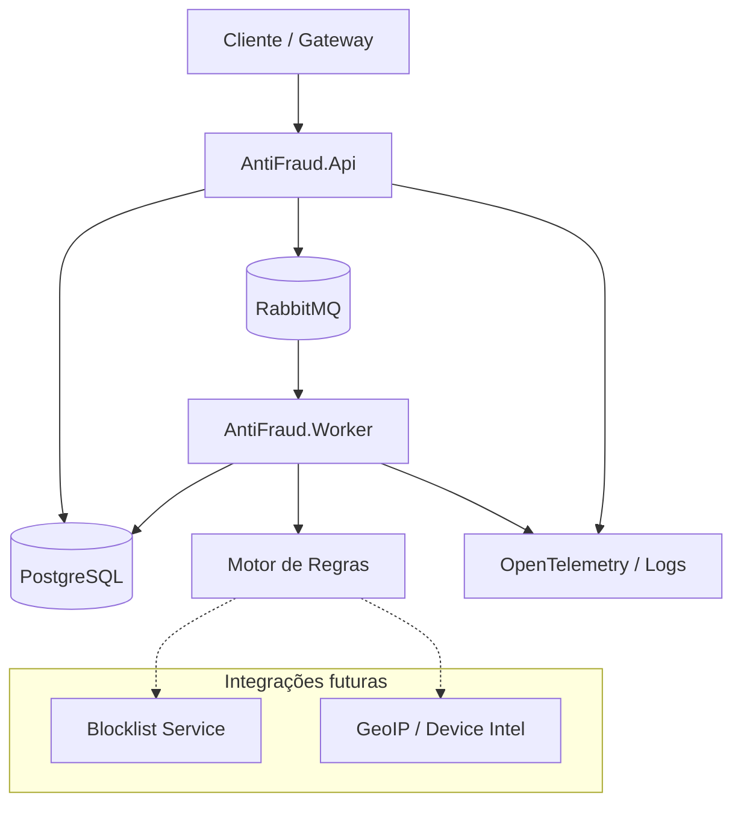
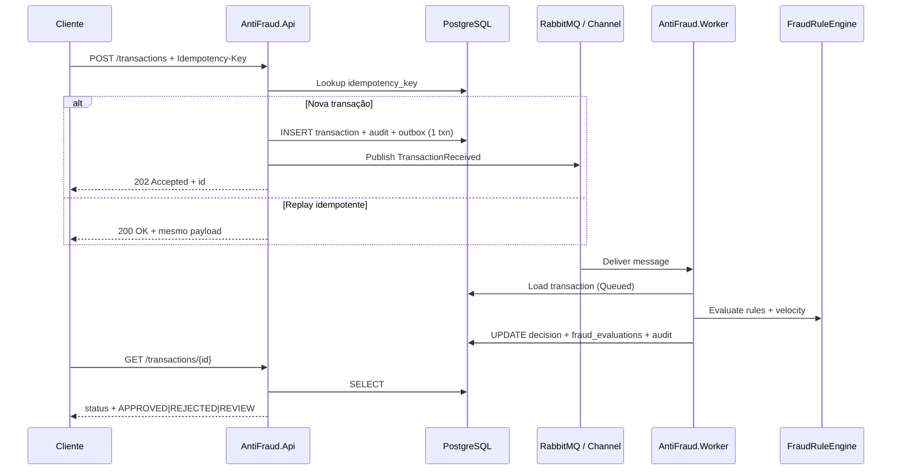

# Teste Técnico — Desenvolvedor Sênior .NET (Antifraude)

> **Objetivo**  
> Avaliar capacidade de **propor soluções arquiteturais**, documentar decisões e estruturar raciocínio técnico para cenários de alta complexidade.

Este repositório contém:

1. **Enunciado do desafio** (o que o candidato deve entregar).
2. **Solução de referência** em `src/AntiFraud/` (.NET 8, **DDD + SOLID**, Clean Architecture).
3. **DDL** em `src/AntiFraud/scripts/ddl.sql` e **ADRs** em `src/AntiFraud/docs/adr/`.

---

## 1) Contexto

A empresa precisa de um **módulo de avaliação antifraude** para processar transações financeiras.  
O módulo recebe transações, aplica regras e devolve uma decisão: `APPROVED`, `REJECTED` ou `REVIEW`.  
O sistema deve ser **idempotente**, **resiliente** e **auditável**.

---

## 2) Escopo do entregável (candidato)

| Item | Descrição |
|------|-----------|
| **A. Documentação** | Visão geral, fluxo E2E, resiliência, idempotência, observabilidade |
| **B. Diagramas (≥2)** | Componentes/containers + sequência ou fluxo |
| **C. ADRs (≥3)** | Mensageria, banco, idempotência (+ deployment opcional) |
| **D. Contrato API** | `POST /transactions` (Idempotency-Key) e `GET /transactions/{id}` |

Formato: **`README.md`** principal, diagramas Mermaid (ou imagens), ADRs no README ou em arquivos dedicados.

---

## 3) Solução de referência (implementação)

### 3.1 Visão geral da arquitetura

Camadas (Clean Architecture + DDD):

| Camada | Projeto | Responsabilidade |
|--------|---------|------------------|
| **Domain** | `AntiFraud.Domain` | Agregado `Transaction`, value objects (`Money`, `IdempotencyKey`), motor de regras (`IFraudRule`, `FraudRuleEngine`), eventos de domínio |
| **Application** | `AntiFraud.Application` | Casos de uso (`ITransactionService`, `IFraudEvaluationService`), orquestração, ports (`IOutboxStore`, `ITransactionQueuePublisher`) |
| **Infrastructure** | `AntiFraud.Infrastructure` | EF Core + PostgreSQL, RabbitMQ, audit trail, outbox |
| **API** | `AntiFraud.Api` | HTTP, validação de contrato, OpenTelemetry + Serilog |
| **Worker** | `AntiFraud.Worker` | Consumo assíncrono e avaliação antifraude |

**SOLID na prática**

- **S** — Serviços de aplicação focados (submit vs evaluate).
- **O** — Novas regras implementam `IFraudRule` sem alterar `FraudRuleEngine`.
- **L** — Repositórios substituíveis via `ITransactionRepository`.
- **I** — Ports pequenos (`IOutboxStore`, `IAuditLogger`).
- **D** — Domain não referencia EF/RabbitMQ; infraestrutura depende do domínio.

### 3.2 Diagrama de componentes (containers)



### 3.3 Fluxo de ponta a ponta



### 3.4 Resiliência

| Mecanismo | Onde | Comportamento |
|-----------|------|----------------|
| **Retry + backoff** | Outbox relay / consumer | Tentativas incrementais (`attempts`), jitter exponencial |
| **DLQ** | `dead_letter_messages` | Mensagens que excedem max retries |
| **Fallback** | API | Falha de publish → transação persistida; worker pode reprocessar via outbox polling |
| **Circuit breaker** | Integrações externas (futuro) | Polly em blocklist/geo |
| **At-least-once** | Fila | Idempotência no worker por status `Completed` |

### 3.5 Idempotência e deduplicação

- Header **`Idempotency-Key`** obrigatório no `POST /transactions`.
- **Unique index** `transactions.idempotency_key`.
- Replay HTTP retorna a mesma representação (`200 OK`); primeira submissão `202 Accepted`.
- Consumer ignora reprocessamento se decisão já finalizada.
- Outbox republication usa `transactionId` como chave lógica.

Detalhes: [ADR 003](AntiFraud/docs/adr/003-idempotencia.md).

### 3.6 Observabilidade

| Pilar | Implementação |
|-------|----------------|
| **Logs** | Serilog estruturado (`Application`, `TransactionId`, `IdempotencyKey`) |
| **Métricas** | `transactions_received_total`, `evaluation_duration_ms`, `decision_total{decision}`, `outbox_lag` |
| **Tracing** | OpenTelemetry ASP.NET Core + HttpClient; propagar `traceparent` API → Worker |
| **Auditoria** | Tabela `audit_logs` (`TRANSACTION_RECEIVED`, `TRANSACTION_EVALUATED`) |

---

## 4) Contrato de API

Base URL (local): `http://localhost:5080`

### POST `/transactions`

**Headers**

| Header | Obrigatório | Descrição |
|--------|-------------|-----------|
| `Idempotency-Key` | Sim | 8–128 caracteres, único por intenção de pagamento |
| `Content-Type` | Sim | `application/json` |

**Body**

```json
{
  "externalReference": "ORD-998877",
  "merchantId": "MRC-001",
  "customerId": "CUS-4421",
  "amount": 1500.50,
  "currency": "BRL",
  "paymentMethod": "CREDIT_CARD",
  "ipAddress": "203.0.113.10",
  "deviceFingerprint": "fp_abc123"
}
```

**Respostas**

| Código | Situação |
|--------|----------|
| `202 Accepted` | Nova transação enfileirada |
| `200 OK` | Replay idempotente |
| `400 Bad Request` | Payload ou header inválido |

**Exemplo**

```bash
curl -X POST http://localhost:5080/transactions \
  -H "Content-Type: application/json" \
  -H "Idempotency-Key: demo-key-001" \
  -d "{\"externalReference\":\"ORD-1\",\"merchantId\":\"M1\",\"customerId\":\"C1\",\"amount\":100,\"currency\":\"BRL\",\"paymentMethod\":\"PIX\"}"
```

### GET `/transactions/{id}`

Retorna status do processamento e decisão antifraude.

```json
{
  "id": "3fa85f64-5717-4562-b3fc-2c963f66afa6",
  "status": "COMPLETED",
  "decision": "APPROVED",
  "decisionReason": "All rules passed within acceptable risk.",
  "createdAtUtc": "2025-09-22T12:00:00Z",
  "completedAtUtc": "2025-09-22T12:00:01Z",
  "evaluations": [
    { "ruleCode": "HIGH_AMOUNT", "passed": true, "score": 0, "message": null }
  ]
}
```

| Campo `decision` | Significado |
|------------------|-------------|
| `PENDING` | Aguardando worker |
| `APPROVED` | Aprovado |
| `REJECTED` | Rejeitado |
| `REVIEW` | Revisão manual |

---

## 5) ADRs (decisões arquiteturais)

| ADR | Tema |
|-----|------|
| [001 — Mensageria RabbitMQ](AntiFraud/docs/adr/001-mensageria-rabbitmq.md) | Fila + outbox |
| [002 — PostgreSQL](AntiFraud/docs/adr/002-banco-postgresql.md) | Store relacional |
| [003 — Idempotência](AntiFraud/docs/adr/003-idempotencia.md) | Dedup API e consumer |
| [004 — Deployment](AntiFraud/docs/adr/004-deployment-containers.md) | Containers / K8s |

---

## 6) Modelo de dados (DDL)

DDL canônico: `[src/docker/pgadmin/scripts/ddl.sql](src/docker/pgadmin/scripts/ddl.sql)` (cópia em `[src/AntiFraud/scripts/ddl.sql](src/AntiFraud/scripts/ddl.sql)`).  
A aplicação **não usa EF migrations** nem `EnsureCreated`; API e Worker só validam conexão e tabelas.

**Tabelas principais**

- `transactions` — agregado raiz (status, decisão, idempotency).
- `fraud_evaluations` — resultado por regra aplicada.
- `audit_logs` — trilha auditável append-only (`payload` JSONB).
- `outbox_messages` — outbox transacional (`payload` JSONB).

**Enums (aplicação)**

- `status`: Received=0, Queued=1, Processing=2, Completed=3, Failed=4  
- `decision`: Pending=0, Approved=1, Rejected=2, Review=3  

---

## 7) Como executar localmente

### Pré-requisitos

- .NET 8 SDK  
- [Docker Desktop](https://www.docker.com/products/docker-desktop/) (Compose v2)  
- Detalhes das stacks: `[src/docker/README.md](src/docker/README.md)`

---

### 7.1 Subir **todos** os containers (Postgres + pgAdmin + RabbitMQ + API + Worker)

Execute na **raiz do repositório** . Ordem: Postgres cria a rede `antifraud-net`; RabbitMQ e AntiFraud usam essa rede.

#### Primeira vez — arquivos `.env`

```powershell
cd src\docker\pgadmin
copy .env.example .env
# Edite .env: POSTGRES_PASSWORD, PGADMIN_DEFAULT_PASSWORD (use aspas se a senha tiver #)

cd src\docker\rabbitmq
@"
RABBITMQ_DEFAULT_USER=antifraud
RABBITMQ_DEFAULT_PASS="SuaSenhaRabbitAqui"
"@ | Out-File -Encoding utf8 .env

cd src\docker\antifraud
@"
POSTGRES_HOST=my-postgres
POSTGRES_PORT=5432
POSTGRES_DB=antifraud
POSTGRES_USER=postgres
POSTGRES_PASSWORD="MesmaSenhaDoPgAdmin"
RABBITMQ_HOST=my-rabbitmq
RABBITMQ_PORT=5672
RABBITMQ_DEFAULT_USER=antifraud
RABBITMQ_DEFAULT_PASS="MesmaSenhaDoRabbit"
USE_RABBITMQ=true
"@ | Out-File -Encoding utf8 .env
```

No **antifraud**, `POSTGRES_PASSWORD` e credenciais Rabbit devem ser **iguais** às de `pgadmin` e `rabbitmq`.

#### Subir tudo (PowerShell)

```powershell

docker compose -f src/docker/pgadmin/docker-compose.yaml up -d
docker compose -f src/docker/rabbitmq/docker-compose.yaml up -d
docker compose -f src/docker/antifraud/docker-compose.yaml up -d --build

docker ps --filter "name=my-postgres" --filter "name=my-pgadmin" --filter "name=my-rabbitmq" --filter "name=antifraud-"
```

#### Subir tudo (CMD)

```cmd

docker compose -f src\docker\pgadmin\docker-compose.yaml up -d
docker compose -f src\docker\rabbitmq\docker-compose.yaml up -d
docker compose -f src\docker\antifraud\docker-compose.yaml up -d --build
```

#### URLs e portas

| Serviço | Endereço |
|---------|----------|
| **Swagger (API)** | http://localhost:5080/swagger |
| **pgAdmin** | http://localhost:15432 |
| **RabbitMQ Management** | http://localhost:15672 |
| **PostgreSQL (host)** | `localhost:5432`, database `antifraud` |

O **DDL** roda automaticamente na **primeira** inicialização do volume Postgres (`src/docker/pgadmin/scripts/ddl.sql`). Se o volume já existia sem tabelas, execute o script manualmente no pgAdmin ou recrie o volume.

#### Parar todos os containers

```powershell

docker compose -f src/docker/antifraud/docker-compose.yaml down
docker compose -f src/docker/rabbitmq/docker-compose.yaml down
docker compose -f src/docker/pgadmin/docker-compose.yaml down
```

Para remover também os volumes Postgres/pgAdmin/Rabbit (apaga dados):

```powershell
docker compose -f src/docker/pgadmin/docker-compose.yaml down -v
docker compose -f src/docker/rabbitmq/docker-compose.yaml down -v
```

---

### 7.2 Rodar API + Worker no host (sem container da app)

Com Postgres no Docker (`localhost:5432`):

1. **User Secrets** (senhas fora do Git): guia `[src/AntiFraud/docs/user-secrets.md](src/AntiFraud/docs/user-secrets.md)` ou script exemplo `src/AntiFraud/scripts/setup-user-secrets.example.cmd` (API + Worker, mesmos valores).
2. Build e execução:

```powershell

dotnet build src\AntiFraud\AntiFraud.sln

dotnet run --project src\AntiFraud\src\AntiFraud.Worker
dotnet run --project src\AntiFraud\src\AntiFraud.Api
```

Swagger (processo local): `http://localhost:5080/swagger` (`launchSettings.json` da API).

`Features:UseRabbitMq` nos `appsettings.json` (API e Worker devem coincidir):

- **`false`:** Worker processa a **outbox** no Postgres (Rabbit opcional).
- **`true`:** API faz relay outbox → Rabbit; Worker consome a fila (credenciais Rabbit via User Secrets ou env).

---

## 8) Critérios de avaliação sugeridos (RH/Tech Lead)

| Critério | Peso |
|----------|------|
| Clareza arquitetural e trade-offs | 25% |
| Idempotência, resiliência e auditoria | 25% |
| Qualidade do contrato API e modelagem | 20% |
| Observabilidade e operação | 15% |
| ADRs e diagramas | 15% |

---

## 9) Estrutura do repositório

```text
├── README.md
└── src/
    ├── docker/               ← pgadmin/, rabbitmq/, antifraud/
    └── AntiFraud/
        ├── AntiFraud.sln
        ├── docs/adr/
        ├── scripts/ddl.sql
        └── src/
            ├── AntiFraud.Domain/
            ├── AntiFraud.Application/
            ├── AntiFraud.Infrastructure/
            ├── AntiFraud.Api/
            └── AntiFraud.Worker/
```

---

## 10) Notas para o time interno

A pasta `AntiFraud/` é uma **referência** para calibrar entrevistas; o candidato **não** precisa entregar código idêntico, mas deve cobrir os tópicos do escopo.  
Para avaliar apenas documentação, peça ao candidato um repositório separado e compare com as seções 3–6 deste README.
