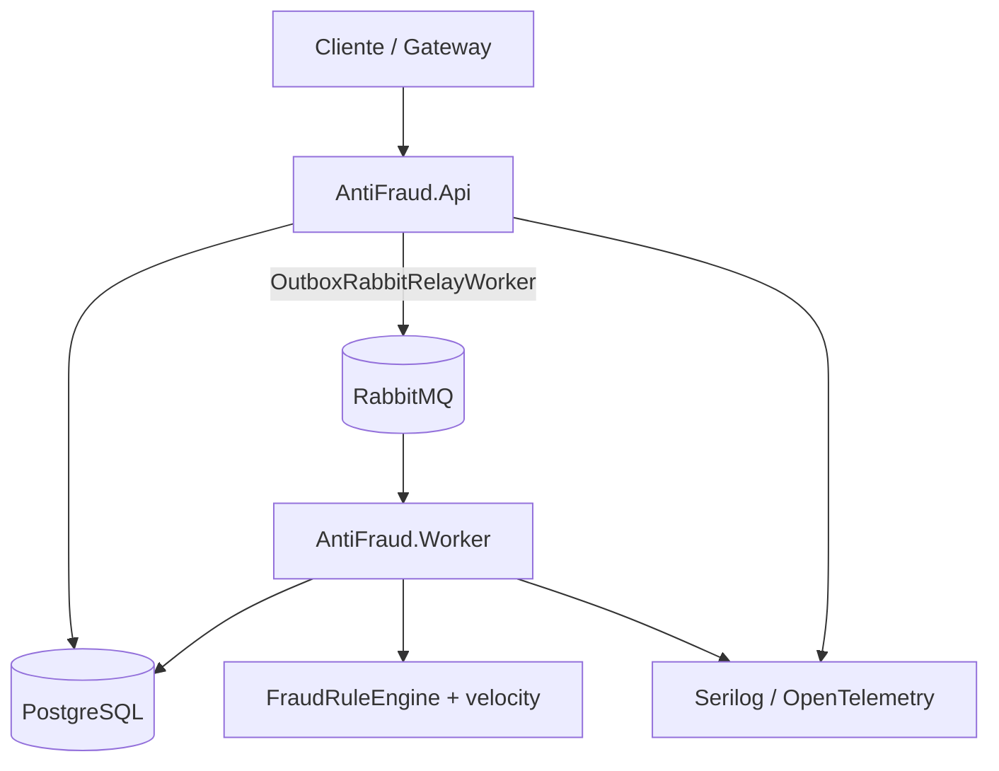
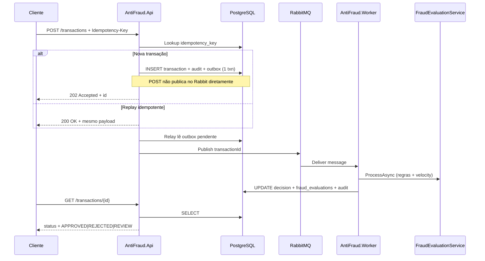

# Teste Técnico — Desenvolvedor Sênior .NET (Antifraude)

> **Objetivo**  
> Avaliar capacidade de **propor soluções arquiteturais**, documentar decisões e estruturar raciocínio técnico para cenários de alta complexidade.

Este repositório contém:

1. **Enunciado do desafio** (o que o candidato deve entregar).
2. **Solução de referência** em `src/AntiFraud/` (.NET 8, **DDD + SOLID**, Clean Architecture).
3. **DDL** em `src/AntiFraud/scripts/ddl.sql` e **ADRs** em `src/AntiFraud/docs/adr/`.

---

## 1) Contexto

A empresa precisa de um **módulo de avaliação antifraude** para processar transações financeiras.  
O módulo recebe transações, aplica regras e devolve uma decisão: `APPROVED`, `REJECTED` ou `REVIEW`.  
O sistema deve ser **idempotente**, **resiliente** e **auditável**.

---

## 2) Escopo do entregável (candidato)

| Item | Descrição |
|------|-----------|
| **A. Documentação** | Visão geral, fluxo E2E, resiliência, idempotência, observabilidade |
| **B. Diagramas (≥2)** | Componentes/containers + sequência ou fluxo |
| **C. ADRs (≥3)** | Mensageria, banco, idempotência (+ deployment opcional) |
| **D. Contrato API** | `POST /transactions` (Idempotency-Key) e `GET /transactions/{id}` |

Formato: **`README.md`** principal, diagramas Mermaid (ou imagens), ADRs no README ou em arquivos dedicados.

---

## 3) Solução de referência (implementação)

### 3.1 Visão geral da arquitetura

Camadas (Clean Architecture + DDD):

| Camada | Projeto | Responsabilidade |
|--------|---------|------------------|
| **Domain** | `AntiFraud.Domain` | Agregado `Transaction`, value objects (`Money`, `IdempotencyKey`), motor de regras (`IFraudRule`, `FraudRuleEngine`), eventos de domínio |
| **Application** | `AntiFraud.Application` | Casos de uso (`ITransactionService`, `IFraudEvaluationService`), orquestração, ports (`IOutboxStore`, `ITransactionQueuePublisher`) |
| **Infrastructure** | `AntiFraud.Infrastructure` | EF Core + PostgreSQL, RabbitMQ, audit trail, outbox |
| **API** | `AntiFraud.Api` | HTTP, contrato, Serilog; com Rabbit: relay outbox → fila |
| **Worker** | `AntiFraud.Worker` | Avaliação antifraude (outbox ou fila Rabbit, conforme config) |

**SOLID na prática**

- **S** — Serviços de aplicação focados (submit vs evaluate).
- **O** — Novas regras implementam `IFraudRule` sem alterar `FraudRuleEngine`.
- **L** — Repositórios substituíveis via `ITransactionRepository`.
- **I** — Ports pequenos (`IOutboxStore`, `IAuditLogger`).
- **D** — Domain não referencia EF/RabbitMQ; infraestrutura depende do domínio.

### 3.2 Diagrama de componentes (containers)



**Mensageria (sempre RabbitMQ + outbox):**

| Processo | Papel |
|----------|--------|
| **API** | Grava outbox no POST; `OutboxRabbitRelayWorker` publica na fila |
| **Worker** | `RabbitMqTransactionEvaluationConsumer` → `ProcessAsync` |

### 3.3 Fluxo de ponta a ponta



### 3.4 Resiliência (implementado vs. evolução)

| Mecanismo | Onde | Comportamento |
|-----------|------|----------------|
| **Outbox transacional** | POST + `outbox_messages` | Transação e evento pendente no mesmo commit |
| **Retry outbox** | Relay / dispatch | `attempts` + `last_error`; pendências reprocessadas no loop (~2 s) |
| **Publish failure** | `RabbitMqTransactionQueuePublisher` | Exceção propagada; outbox **não** marcada processada |
| **At-least-once** | Rabbit + outbox | `ProcessAsync` ignora se `status = Completed`; ack/nack no consumer |
| **Recovery** | `OutboxRabbitRelayWorker` | Republica transações QUEUED sem outbox pendente (cooldown) |
| **DLQ / backoff exponencial** | — | **Não implementado** (sem tabela `dead_letter_messages` no DDL) |
| **Circuit breaker** | — | **Futuro** (blocklist/geo) |

### 3.5 Idempotência e deduplicação

- Header **`Idempotency-Key`** obrigatório no `POST /transactions`.
- **Unique index** `transactions.idempotency_key`.
- Replay HTTP retorna a mesma representação (`200 OK`); primeira submissão `202 Accepted`.
- Consumer ignora reprocessamento se decisão já finalizada.
- Outbox republication usa `transactionId` como chave lógica.

Detalhes: [ADR 003](src/AntiFraud/docs/adr/003-idempotencia.md).

### 3.6 Observabilidade

| Pilar | Implementação |
|-------|----------------|
| **Logs** | Serilog na API e Worker; dashboard **Aspire** opcional (AppHost) |
| **Tracing** | OpenTelemetry (ASP.NET Core + HttpClient) na API |
| **Auditoria** | Tabela `audit_logs` (`TRANSACTION_RECEIVED`, `TRANSACTION_EVALUATED`) |
| **Métricas Prometheus customizadas** | **Não implementadas** (evolução futura) |

### 3.7 Regras de risco (referência)

| Regra | Condição (resumo) | Score se falhar |
|-------|-------------------|-----------------|
| `HIGH_AMOUNT` | Valor ≥ 10.000 | 60 |
| `VELOCITY` | ≥ 5 transações do mesmo `customerId` em 10 min | 70 (aplicada no `FraudEvaluationService`) |

Soma dos scores das regras que falharam: **≥ 100** → `REJECTED`; **≥ 50** → `REVIEW`; caso contrário → `APPROVED`.

---

## 4) Contrato de API

Base URL (local): `http://localhost:5080`

### POST `/transactions`

**Headers**

| Header | Obrigatório | Descrição |
|--------|-------------|-----------|
| `Idempotency-Key` | Sim | 8–128 caracteres, único por intenção de pagamento |
| `Content-Type` | Sim | `application/json` |

**Body**

```json
{
  "externalReference": "ORD-998877",
  "merchantId": "MRC-001",
  "customerId": "CUS-4421",
  "amount": 1500.50,
  "currency": "BRL",
  "paymentMethod": "CREDIT_CARD",
  "ipAddress": "203.0.113.10",
  "deviceFingerprint": "fp_abc123"
}
```

**Respostas**

| Código | Situação |
|--------|----------|
| `202 Accepted` | Nova transação enfileirada |
| `200 OK` | Replay idempotente |
| `400 Bad Request` | Payload ou header inválido |

**Exemplo**

```bash
curl -X POST http://localhost:5080/transactions \
  -H "Content-Type: application/json" \
  -H "Idempotency-Key: demo-key-001" \
  -d "{\"externalReference\":\"ORD-1\",\"merchantId\":\"M1\",\"customerId\":\"C1\",\"amount\":100,\"currency\":\"BRL\",\"paymentMethod\":\"PIX\"}"
```

### GET `/transactions/{id}`

Retorna status do processamento e decisão antifraude.

```json
{
  "id": "3fa85f64-5717-4562-b3fc-2c963f66afa6",
  "status": "COMPLETED",
  "decision": "APPROVED",
  "decisionReason": "All rules passed within acceptable risk.",
  "createdAtUtc": "2025-09-22T12:00:00Z",
  "completedAtUtc": "2025-09-22T12:00:01Z",
  "evaluations": [
    { "ruleCode": "HIGH_AMOUNT", "passed": true, "score": 0, "message": null }
  ]
}
```

| Campo `decision` | Significado |
|------------------|-------------|
| `PENDING` | Aguardando worker |
| `APPROVED` | Aprovado |
| `REJECTED` | Rejeitado |
| `REVIEW` | Revisão manual |

---

## 5) ADRs (decisões arquiteturais)

| ADR | Tema |
|-----|------|
| [001 — Mensageria RabbitMQ](src/AntiFraud/docs/adr/001-mensageria-rabbitmq.md) | Outbox + Rabbit opcional |
| [002 — PostgreSQL](src/AntiFraud/docs/adr/002-banco-postgresql.md) | Store relacional |
| [003 — Idempotência](src/AntiFraud/docs/adr/003-idempotencia.md) | Dedup API e consumer |
| [004 — Deployment](src/AntiFraud/docs/adr/004-deployment-containers.md) | Containers / Aspire local |

---

## 6) Modelo de dados (DDL)

DDL canônico: `[src/AntiFraud/scripts/ddl.sql](src/AntiFraud/scripts/ddl.sql)`.  
A aplicação **não usa EF migrations** nem `EnsureCreated`; API e Worker só validam conexão e tabelas.

**Tabelas principais**

- `transactions` — agregado raiz (status, decisão, idempotency).
- `fraud_evaluations` — resultado por regra aplicada.
- `audit_logs` — trilha auditável append-only (`payload` JSONB).
- `outbox_messages` — outbox transacional (`payload` JSONB).

**Enums (aplicação)**

- `status`: Received=0, Queued=1, Processing=2, Completed=3, Failed=4  
- `decision`: Pending=0, Approved=1, Rejected=2, Review=3  

---

## 7) Como executar localmente

### Pré-requisitos

- .NET 8 SDK  
- [Docker Desktop](https://www.docker.com/products/docker-desktop/) (runtime dos containers Aspire)  
- **User Secrets** — [src/AntiFraud/docs/user-secrets.md](src/AntiFraud/docs/user-secrets.md)

Configure **User Secrets** uma vez — passos em [src/AntiFraud/docs/user-secrets.md](src/AntiFraud/docs/user-secrets.md).

---

### 7.1 Rodar com **.NET Aspire** (padrão)

Postgres, RabbitMQ, pgAdmin, API e Worker via AppHost + dashboard.

```bash
dotnet run --project src/AntiFraud/AntiFraud.AppHost/AntiFraud.AppHost.csproj --launch-profile https
```

| Serviço | Endereço |
|---------|----------|
| **Dashboard Aspire** | abre no browser ao subir o AppHost |
| **Swagger (API)** | http://localhost:5080/swagger (confirmar no dashboard) |
| **pgAdmin** | http://localhost:15433/login |
| **PostgreSQL (host)** | `localhost:5432`, database `antifraud` |

O **DDL** corre na 1ª inicialização do volume Postgres (`src/AntiFraud/scripts/ddl.sql`) e via `DatabaseSchemaBootstrap` na API/Worker.

**Reset de dados/senha** (AppHost parado): `docker volume rm antifraud-aspire-postgres-data antifraud-aspire-rabbitmq-data` — detalhes em [aspire.md](src/AntiFraud/docs/aspire.md).

Documentação: [src/AntiFraud/README.md](src/AntiFraud/README.md).

---

### 7.2 Testes de stress e regras (k6)

Pasta: **[src/AntiFraud/tests/k6/](src/AntiFraud/tests/k6/)** — instale o [k6](https://grafana.com/docs/k6/latest/set-up/install-k6/).

Com **API + Worker** no ar:

```bash
cd src/AntiFraud/tests/k6

# Valida APPROVED / REVIEW / REJECTED (regras HIGH_AMOUNT + VELOCITY)
k6 run -e BASE_URL=http://localhost:5080 fraud-rules.js

# Stress com mix de transações aceitas e picos de risco
k6 run -e BASE_URL=http://localhost:5080 stress-mixed.js
```

Guia completo: [src/AntiFraud/tests/k6/README.md](src/AntiFraud/tests/k6/README.md).

### 7.3 Testes unitários (xUnit)

```bash
cd src/AntiFraud
dotnet test tests/AntiFraud.UnitTests/AntiFraud.UnitTests.csproj
```

Detalhes: [src/AntiFraud/tests/AntiFraud.UnitTests/README.md](src/AntiFraud/tests/AntiFraud.UnitTests/README.md).

---

## 8) Critérios de avaliação sugeridos (RH/Tech Lead)

| Critério | Peso |
|----------|------|
| Clareza arquitetural e trade-offs | 25% |
| Idempotência, resiliência e auditoria | 25% |
| Qualidade do contrato API e modelagem | 20% |
| Observabilidade e operação | 15% |
| ADRs e diagramas | 15% |

---

## 9) Estrutura do repositório

```text
├── README.md
└── src/
    ├── docker/                    ← Dockerfiles de referência (ADR 004); dev local = Aspire
    └── AntiFraud/
        ├── AntiFraud.AppHost/
        ├── AntiFraud.sln
        ├── docs/                  ← adr/, aspire.md, user-secrets.md
        ├── scripts/               ← ddl.sql
        ├── tests/
        │   ├── AntiFraud.UnitTests/  ← xUnit
        │   └── k6/                   ← stress / fraud-rules
        └── src/
            ├── AntiFraud.Domain/
            ├── AntiFraud.Application/
            ├── AntiFraud.Infrastructure/
            ├── AntiFraud.Api/
            └── AntiFraud.Worker/
```

---

## 10) Notas para o time interno

A pasta `AntiFraud/` é uma **referência** para calibrar entrevistas; o candidato **não** precisa entregar código idêntico, mas deve cobrir os tópicos do escopo.  
Para avaliar apenas documentação, peça ao candidato um repositório separado e compare com as seções 3–6 deste README.
